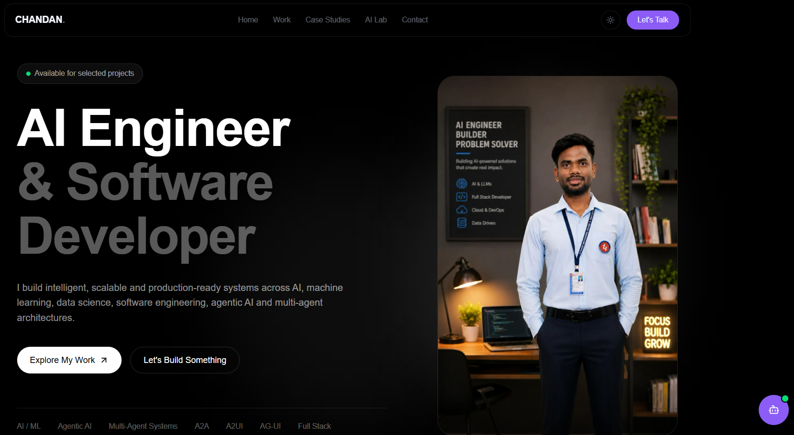

# ckmhto.ai

<p align="center">
  <strong>AI Engineer & Software Developer Portfolio</strong>
</p>

<p align="center">
  A full-stack AI portfolio platform built with Next.js, FastAPI,
  PostgreSQL, Neon and Groq.
</p>

<p align="center">
  <a href="https://ckmhto-ai.vercel.app/">Live Portfolio</a>
  ·
  <a href="#architecture">Architecture</a>
  ·
  <a href="#local-development">Local Development</a>
  ·
  <a href="#api">API</a>
</p>

---

## Overview

**ckmhto.ai** is the personal portfolio platform of **Chandan Kumar**,
focused on AI engineering, software engineering and intelligent systems.

The project is built as a complete full-stack application rather than
a static portfolio page.

It combines:

- A modern responsive portfolio frontend
- A Python FastAPI backend
- PostgreSQL database
- Neon cloud PostgreSQL
- LLM-powered portfolio chatbot
- Groq inference
- Persistent conversation history
- Database migrations with Alembic
- Environment-based configuration
- Production-oriented project structure

The platform is designed to demonstrate both the **engineering work**
and the **systems behind the work**.

---
## 🖥️ Portfolio Preview



> AI Engineer & Software Developer portfolio built with modern
> AI, full-stack, backend and cloud technologies.

# ✨ Features

## Portfolio

- Personal hero section
- About section
- Expertise and focus areas
- Project showcase
- Project library
- Case studies
- AI Lab
- Contact section
- Responsive navigation
- Dark / light theme
- Personal branding and visual identity

## AI Portfolio Assistant

The website includes a floating AI assistant that visitors can use to
ask questions about the portfolio.

The assistant can provide information about:

- Projects
- Technologies
- Skills
- AI engineering work
- Software engineering work
- Portfolio information

The chatbot is connected to the backend instead of calling the LLM
directly from the browser.

This keeps the LLM API key on the server side.

---

# 🧠 AI Chatbot

The chatbot follows a backend-controlled architecture.

```text
Visitor
   │
   ▼
Chatbot UI
   │
   │ POST /api/chat/
   ▼
FastAPI Backend
   │
   ├───────────────┐
   │               │
   ▼               ▼
Chat History   Portfolio Context
   │               │
   └───────┬───────┘
           ▼
       Groq LLM
           │
           ▼
      AI Response
           │
           ▼
      Chatbot UI
````

The backend:

1. Receives the user's message.
2. Identifies the conversation using `conversation_id`.
3. Loads relevant chat history.
4. Loads portfolio/project information from PostgreSQL.
5. Builds the LLM message context.
6. Sends the request to Groq.
7. Receives the generated response.
8. Stores the user message and assistant response.
9. Returns the response to the frontend.

---

# 💬 Conversation Management

Each chatbot session uses a unique:

```text
conversation_id
```

Messages belonging to the same conversation are stored together.

Example:

```text
conversation_id
       │
       ├── User message
       ├── Assistant response
       ├── User message
       ├── Assistant response
       └── ...
```

The frontend keeps the conversation identifier for the active browser
session and sends it with each chat request.

The backend uses that identifier to retrieve previous messages.

---

# 🏗️ Architecture

```text
                         ┌──────────────────┐
                         │     Visitor      │
                         └────────┬─────────┘
                                  │
                                  ▼
                    ┌─────────────────────────┐
                    │        Next.js          │
                    │        Frontend         │
                    │                         │
                    │  Portfolio              │
                    │  Projects               │
                    │  Case Studies           │
                    │  AI Lab                 │
                    │  Contact                │
                    │  Chatbot                │
                    └────────────┬────────────┘
                                 │
                              REST API
                                 │
                                 ▼
                    ┌─────────────────────────┐
                    │        FastAPI          │
                    │        Backend          │
                    │                         │
                    │  API Routes             │
                    │  Services               │
                    │  Schemas                │
                    │  Models                 │
                    │  Business Logic         │
                    └────────────┬────────────┘
                                 │
                  ┌──────────────┴──────────────┐
                  │                             │
                  ▼                             ▼
        ┌──────────────────┐          ┌──────────────────┐
        │    PostgreSQL    │          │      Groq        │
        │                  │          │       LLM        │
        │  Projects        │          │                  │
        │  Chat Messages   │          │  AI Generation   │
        │  Conversations   │          │                  │
        └──────────────────┘          └──────────────────┘
                  │
                  ▼
             Neon Cloud
```

---

# 🛠️ Tech Stack

## Frontend

| Technology   | Role               |
| ------------ | ------------------ |
| Next.js      | Frontend framework |
| React        | UI library         |
| TypeScript   | Type safety        |
| Tailwind CSS | Styling            |
| Lucide React | UI icons           |

## Backend

| Technology | Role                            |
| ---------- | ------------------------------- |
| Python     | Backend language                |
| FastAPI    | REST API framework              |
| SQLAlchemy | ORM / database access           |
| Pydantic   | Request and response validation |
| Uvicorn    | ASGI server                     |
| Alembic    | Database migrations             |

## Database

| Technology       | Role                         |
| ---------------- | ---------------------------- |
| PostgreSQL       | Application database         |
| Neon             | Cloud PostgreSQL             |
| SQLAlchemy Async | Asynchronous database access |
| Alembic          | Schema migration management  |

## AI

| Technology           | Role                        |
| -------------------- | --------------------------- |
| Groq                 | LLM inference               |
| Groq-supported LLM   | Chat response generation    |
| Portfolio Context    | Grounding chatbot responses |
| Conversation History | Conversational context      |

## Development

| Technology            | Role                                  |
| --------------------- | ------------------------------------- |
| Git                   | Version control                       |
| GitHub                | Repository hosting                    |
| Docker                | Containerization / deployment support |
| Environment Variables | Configuration and secrets             |

---

# 📁 Project Structure

```text
chandan-portfolio/
│
├── frontend/
│   │
│   ├── app/
│   │   ├── case-studies/
│   │   ├── contact/
│   │   ├── lab/
│   │   ├── projects/
│   │   ├── writing/
│   │   ├── globals.css
│   │   ├── icon.png
│   │   ├── layout.tsx
│   │   └── page.tsx
│   │
│   ├── components/
│   │   ├── chatbot/
│   │   ├── layout/
│   │   └── sections/
│   │
│   ├── lib/
│   ├── public/
│   ├── package.json
│   └── ...
│
├── backend/
│   │
│   ├── app/
│   │   ├── api/
│   │   │   └── routes/
│   │   ├── core/
│   │   ├── models/
│   │   ├── schemas/
│   │   └── services/
│   │
│   ├── alembic/
│   ├── requirements.txt
│   └── ...
│
├── docs/
│   ├── API.md
│   ├── ARCHITECTURE.md
│   ├── DATABASE.md
│   └── DEPLOYMENT.md
│
├── .env.example
├── .gitignore
├── CHANGELOG.md
├── CODE_OF_CONDUCT.md
├── CONTRIBUTING.md
├── LICENSE
├── README.md
└── SECURITY.md
```

---

# 🚀 Local Development

## Prerequisites

Make sure the following are installed:

* Node.js
* npm
* Python 3.12+
* Git
* A PostgreSQL-compatible database
* Groq API key

---

# 1. Clone the Repository

```bash
git clone <https://github.com/kchandanmahto/ckmhto.ai.git>
cd chandan-portfolio
```

---

# 2. Frontend Setup

Move into the frontend:

```bash
cd frontend
```

Install dependencies:

```bash
npm install
```

Create the local environment file:

```text
.env.local
```

Configure the required frontend environment variables.

Start the development server:

```bash
npm run dev
```

Frontend:

```text
http://localhost:3000
```

---

# 3. Backend Setup

Open another terminal.

Move into the backend:

```bash
cd backend
```

Create a virtual environment:

```powershell
python -m venv .venv
```

Activate it:

```powershell
.\.venv\Scripts\Activate.ps1
```

Install dependencies:

```powershell
pip install -r requirements.txt
```

Create:

```text
.env
```

Configure the required backend variables.

---

# 4. Database Setup

The backend uses PostgreSQL.

For the cloud database, the project is configured to work with
**Neon PostgreSQL**.

Run database migrations:

```powershell
alembic upgrade head
```

Check the current migration:

```powershell
alembic current
```

View migration history:

```powershell
alembic history
```

---

# 5. Start the Backend

Run:

```powershell
python -m uvicorn app.main:app --reload
```

Backend:

```text
http://127.0.0.1:8000
```

FastAPI documentation:

```text
http://127.0.0.1:8000/docs
```

ReDoc:

```text
http://127.0.0.1:8000/redoc
```

---

# 🔐 Environment Variables

Secrets must never be committed to the repository.

The project uses environment variables for configuration.

Example:

```env
DATABASE_URL=your_postgresql_connection_string

GROQ_API_KEY=your_groq_api_key

GROQ_MODEL=your_groq_model
```

The repository contains:

```text
.env.example
```

as a reference.

Local secrets should remain inside:

```text
.env
```

or:

```text
.env.local
```

depending on the application.

Production secrets should be configured through the deployment platform.

---

# 🔌 API

The backend exposes REST APIs through FastAPI.

## Chat

```http
POST /api/chat/
```

Example request:

```json
{
  "conversation_id": "conversation-uuid",
  "message": "Tell me about Chandan's AI projects."
}
```

Example response:

```json
{
  "conversation_id": "conversation-uuid",
  "reply": "..."
}
```

---

# 🧪 Testing & Quality Checks

Before pushing changes, verify the frontend.

### Lint

```bash
npm run lint
```

### Production Build

```bash
npm run build
```

### Production Start

```bash
npm run start
```

For the backend, verify:

```text
GET /
```

and:

```text
/docs
```

Also verify the chatbot request through:

```text
POST /api/chat/
```

---

# 🗄️ Database Migrations

Database schema changes are managed through Alembic.

Create a migration:

```bash
alembic revision --autogenerate -m "describe database change"
```

Apply migrations:

```bash
alembic upgrade head
```

Check current revision:

```bash
alembic current
```

View history:

```bash
alembic history
```

Production database changes should be applied through migrations rather
than manually modifying tables.

---

# 🔒 Security

The application follows basic security practices:

* Secrets are stored outside source code.
* API keys are not committed to Git.
* Backend controls access to the LLM API.
* Request data is validated.
* Database access is handled through the backend.
* CORS should be restricted in production.
* Production traffic should use HTTPS.
* Environment-specific configuration is separated from application code.

For reporting security issues, see:

```text
SECURITY.md
```

---

# 📚 Documentation

Technical documentation is maintained separately inside `docs/`.

```text
docs/
├── API.md
├── ARCHITECTURE.md
├── DATABASE.md
└── DEPLOYMENT.md
```

### API

API endpoints and request/response behavior.

```text
docs/API.md
```

### Architecture

Application architecture and major system components.

```text
docs/ARCHITECTURE.md
```

### Database

Database structure and migration strategy.

```text
docs/DATABASE.md
```

### Deployment

Production deployment process and configuration.

```text
docs/DEPLOYMENT.md
```

---

# 🔄 Development Workflow

```text
                 Feature
                    │
                    ▼
            Local Development
                    │
                    ▼
             Implementation
                    │
                    ▼
              Local Testing
                    │
          ┌─────────┴─────────┐
          ▼                   ▼
       Frontend             Backend
        Lint                 API
        Build                DB
          │                   │
          └─────────┬─────────┘
                    ▼
                  Git
                    │
                    ▼
                 Commit
                    │
                    ▼
                  Push
                    │
                    ▼
               Deployment
```

---

# 🚢 Deployment

The application is structured so that frontend and backend can be deployed
as separate services.

Production architecture:

```text
                         Internet
                            │
              ┌─────────────┴─────────────┐
              │                           │
              ▼                           ▼
        Frontend Service            Backend Service
          Next.js                     FastAPI
              │                           │
              │                     ┌─────┴─────┐
              │                     │           │
              │                     ▼           ▼
              │                PostgreSQL     Groq
              │                  / Neon         LLM
              │
              └─────────────── Browser
```

Before deployment, verify:

```text
[ ] Frontend lint passes
[ ] Frontend production build passes
[ ] Backend starts successfully
[ ] Database connection works
[ ] Alembic migrations are applied
[ ] Chatbot API works
[ ] Groq API works
[ ] Production environment variables configured
[ ] CORS configured correctly
[ ] HTTPS enabled
[ ] Production URLs configured
```

Detailed deployment instructions:

```text
docs/DEPLOYMENT.md
```

---

# 🎯 Engineering Principles

## Production over Prototype

The goal is to build systems that can move beyond a local demo and operate
as maintainable applications.

## Clear Separation of Responsibilities

Frontend, backend, database and AI services have clearly defined roles.

## Security by Default

Secrets and credentials should remain outside the source code.

## Context-Aware AI

The chatbot should use available portfolio information instead of relying
only on generic LLM knowledge.

## Maintainability

Readable structure and predictable architecture are preferred over
unnecessary complexity.

## Continuous Improvement

The platform is designed to evolve as new AI engineering techniques and
technologies are explored.

---

# 🗺️ Roadmap

## Portfolio

* [x] Portfolio foundation
* [x] Responsive navigation
* [x] Dark / light theme
* [x] Hero section
* [x] About section
* [x] Projects section
* [x] Case studies structure
* [x] AI Lab structure
* [x] Contact section
* [x] Personal visual identity

## Backend

* [x] FastAPI application
* [x] PostgreSQL integration
* [x] Neon database
* [x] SQLAlchemy
* [x] Alembic migrations
* [x] Chat API
* [x] Conversation ID
* [x] Chat history

## AI

* [x] Groq integration
* [x] Portfolio-aware chatbot
* [x] Project context
* [x] Conversation context

## Production

* [ ] Production deployment
* [ ] Automated test suite
* [ ] CI/CD pipeline
* [ ] Production monitoring
* [ ] Performance optimization
* [ ] Security hardening

## Future AI Engineering

* [ ] Advanced RAG
* [ ] Semantic project search
* [ ] Agentic workflows
* [ ] Multi-agent demonstrations
* [ ] A2A demonstrations
* [ ] A2UI demonstrations
* [ ] AG-UI demonstrations
* [ ] AI evaluation workflows

---

# 🤝 Contributing

This is primarily a personal portfolio project.

Technical suggestions, improvements and bug reports are welcome.

Please read:

```text
CONTRIBUTING.md
```

before submitting changes.

---

# 📜 Code of Conduct

All contributors and participants are expected to maintain a respectful,
professional and constructive environment.

See:

```text
CODE_OF_CONDUCT.md
```

---

# 📄 License

This project is distributed under the terms specified in:

```text
LICENSE
```

---

# 👨‍💻 Author

## Chandan Kumar

**AI Engineer & Software Developer**

Focused on:

```text
Artificial Intelligence
Machine Learning
Generative AI
Agentic AI
Multi-Agent Systems
LLM Applications
A2A
A2UI
AG-UI
Python
FastAPI
Next.js
PostgreSQL
Docker
Cloud
DevOps
```

---

# 🌐 Links

### Portfolio

[https://ckmhto.ai](https://ckmhto.ai)

### GitHub

[https://github.com/kchandanmahto/ckmhto.ai](https://github.com/kchandanmahto/ckmhto.ai)

### LinkedIn

[https://www.linkedin.com/in/kchandanmahto](https://www.linkedin.com/in/kchandanmahto)

---

# 📌 Project Status

```text
Project      : ckmhto.ai
Type         : Full-Stack AI Portfolio
Frontend     : Next.js + TypeScript
Backend      : FastAPI + Python
Database     : PostgreSQL / Neon
AI           : Groq
Architecture : Full-Stack AI Application
Status       : Active Development
```

---

<p align="center">
  <strong>ckmhto.ai</strong>
</p>

<p align="center">
  AI Engineering · Software Engineering · Intelligent Systems
</p>

<p align="center">
  Built with engineering discipline and AI-first thinking.
</p>
```
